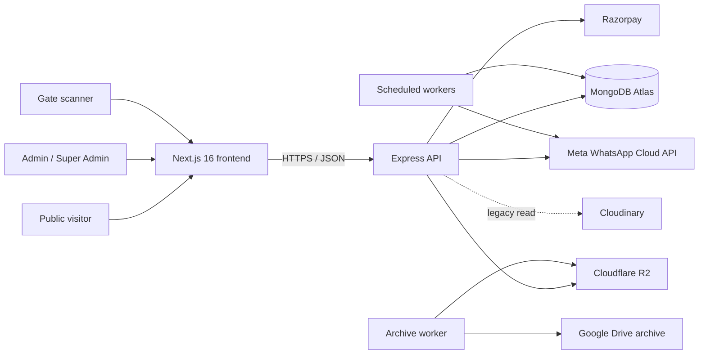
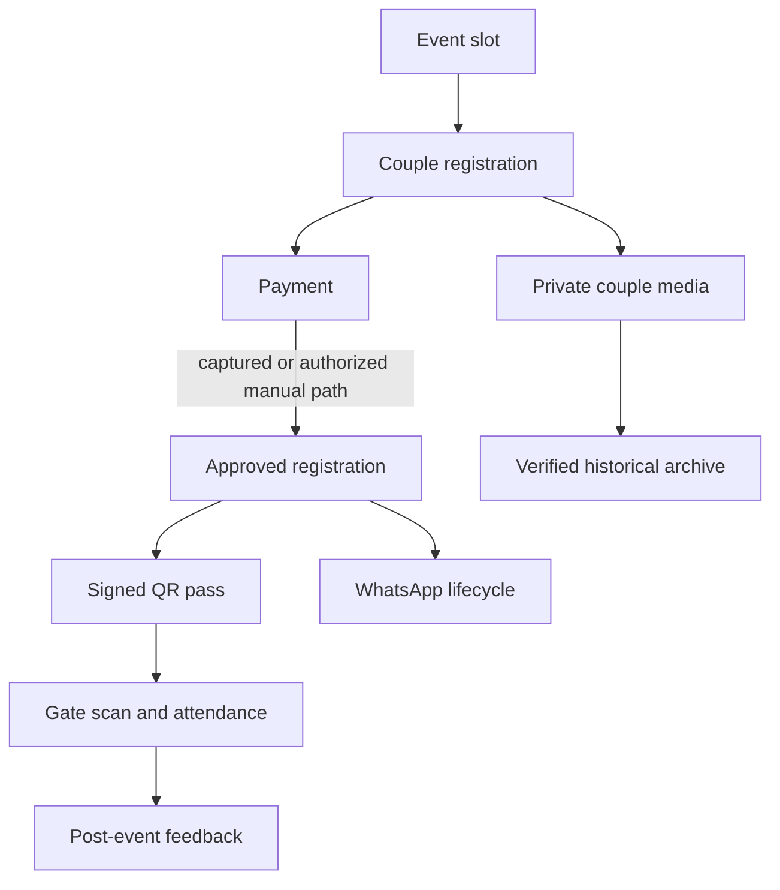

<div align="center">
  

  # Ek Duje Ke Liye

  **A complete multi-event operations platform for couples seminars**

  Public registrations · Razorpay payments · Personalized invitations · QR passes  
  Gate scanning · WhatsApp automation · VIP operations · Media archive

  
  
  
  
  
</div>

---

## Overview

Ek Duje Ke Liye is the operational system behind a multi-city couples-seminar program. It connects the complete customer and event journey—from discovering an event and registering as a couple to payment, invitation delivery, entry scanning, post-event feedback, and long-term media archival.

The platform contains a public website, event-admin workspace, super-admin command center, background communication workers, payment and webhook processing, an offline-capable gate scanner, and storage/backup infrastructure.

> [!IMPORTANT]
> This repository handles live registrations, payments, customer communication, QR passes, and private couple media. Read the project rules before changing application code.

## Table of contents

- [Product capabilities](#product-capabilities)
- [System architecture](#system-architecture)
- [Core domain model](#core-domain-model)
- [Technology stack](#technology-stack)
- [Repository structure](#repository-structure)
- [Quick start](#quick-start)
- [Environment configuration](#environment-configuration)
- [Development commands](#development-commands)
- [Testing and quality](#testing-and-quality)
- [Development rules](#development-rules)
- [Security and operational safety](#security-and-operational-safety)
- [Documentation](#documentation)
- [Contribution workflow](#contribution-workflow)

## Product capabilities

| Area | Capabilities |
|---|---|
| Public experience | Event discovery, event details, internal/external registration, legal pages, contact information, galleries, and testimonials |
| Event operations | Event slots, Date TBA support, capacity, pricing, registration/payment modes, venue, templates, and lifecycle controls |
| Registrations | Normal and early registration, duplicate prevention, photo upload, status lookup, approval/rejection, transfer, trash, and restoration |
| Payments | Razorpay order creation, checkout verification, signed webhooks, payment ledger, reminders, finance, and refund-aware state |
| Passes and invitations | Personalized invitation rendering, signed QR passes, photo positioning, public pass access, and reissue support |
| Gate scanner | Online scanning, encrypted offline roster, signature verification, manual attendance, synchronization, and conflict handling |
| VIP operations | Controlled VIP links, quotas, sponsor/category attribution, VIP registration, passes, attendance, and export |
| WhatsApp Center | Automated lifecycle messages, event dashboards, per-couple timeline, retries, templates, and post-event operations |
| Support inbox | Two-way conversations, service-window replies, approved templates, assignment, unread state, and internal notes |
| Broadcasts | Audience preview, consent filtering, test mode, queued campaigns, delivery status, and campaign logs |
| Media and storage | Private R2 uploads, WebP variants, signed access, legacy Cloudinary fallback, and Google Drive archive |
| Administration | Dashboards, feedback, testimonials, settings, notifications, exports, backups, resource telemetry, and integration health |

## System architecture



### Runtime request path

```text
Next.js route
  → feature page/component
  → typed frontend service
  → Express route and authorization middleware
  → controller
  → domain service or provider integration
  → MongoDB / Razorpay / WhatsApp / R2 / Drive
```

### Backend startup path

```text
backend/index.js
  → src/server.js
  → validate environment and provider modes
  → connect MongoDB
  → initialize event and backup services
  → start communication/payment-reminder worker
  → start Express application
```

## Core domain model

The **event** is the root business boundary.



Important invariants:

- Every relevant record remains scoped to its canonical event.
- `all` is an admin reporting scope, never a stored event ID.
- The backend owns price, capacity, authorization, payment truth, consent, and state transitions.
- Payment, webhook, pass, message, scan, archive, and migration operations are idempotent.
- Business scheduling is calculated in `Asia/Kolkata`; stored timestamps are UTC.

## Technology stack

### Frontend

| Technology | Purpose |
|---|---|
| Next.js 16 App Router | Public and administrative routing |
| React 19 | Interactive application UI |
| TypeScript 5 | Frontend contracts and type safety |
| Tailwind CSS 4 | Responsive styling and design system |
| react-hot-toast | Shared transient notifications |
| QRCode, jsQR, and Web Crypto | Pass generation and offline verification |
| JSZip and Canvas | Batch exports, invitation, and frame rendering |

### Backend

| Technology | Purpose |
|---|---|
| Node.js ES modules | Application runtime |
| Express 4 | HTTP API, middleware, and webhooks |
| Mongoose 9 / MongoDB Atlas | Domain persistence and indexes |
| Razorpay SDK | Orders, payment verification, and webhooks |
| Meta Graph API | WhatsApp templates, lifecycle messages, and inbox |
| Cloudflare R2 | Active public/private media storage |
| Cloudinary | Legacy media read compatibility |
| Google Drive | Verified historical archive and backup destination |
| Sharp and Jimp | Image transformation and rendering |

## Repository structure

```text
ekdujekeliye/
├── frontend/
│   ├── public/                       Static images and scanner assets
│   ├── scripts/                      Frontend verification utilities
│   └── src/
│       ├── app/                      Next.js routes
│       ├── components/               Shared UI and layout components
│       ├── features/                 Admin and super-admin domains
│       ├── services/                 API and browser services
│       ├── types/                    Shared TypeScript contracts
│       └── utils/                    Date, media, and safe-storage helpers
├── backend/
│   ├── scripts/                      Audit, migration, repair, and verification tools
│   ├── tests/                        Domain and lifecycle tests
│   └── src/
│       ├── config/                   Environment, database, and CORS
│       ├── middleware/               Authentication, errors, and request logging
│       ├── models/                   MongoDB schemas and indexes
│       ├── modules/                  Domain routes, controllers, and services
│       ├── integrations/             Razorpay, WhatsApp, R2, Drive, and Cloudinary
│       ├── jobs/                     Scheduled job entry points
│       ├── workers/                  Background processors
│       └── services/                 Cross-domain orchestration
├── rules/                             Canonical modular development rulebooks
├── docs/                              Architecture and operational documentation
├── scripts/                           Repository-wide audit tooling
├── AGENTS.md                          Repository instructions for coding agents
├── ANTIGRAVITY.md                     Antigravity development entry
└── PROJECT_RULEBOOK.md                Complete combined rules reference
```

The planned domain-by-domain destination structure is documented in [`rules/16-code-restructure-manifest.md`](rules/16-code-restructure-manifest.md). Application files must be migrated in verified batches rather than through an unsafe mass rename.

## Quick start

### Prerequisites

- Node.js supported by Next.js 16
- npm
- A non-production MongoDB database
- Test credentials for external integrations you intend to exercise

### 1. Start the backend

```powershell
cd backend
npm install
Copy-Item .env.example .env
npm run dev
```

Configure `backend/.env` with a test database and test provider modes before starting. Default local API: `http://localhost:5001`.

### 2. Start the frontend

Open another terminal from the repository root:

```powershell
cd frontend
npm install
Copy-Item .env.example .env.local
npm run dev
```

Default local website: `http://localhost:3000`.

### 3. Verify local health

```powershell
Invoke-RestMethod http://localhost:5001/api/health
```

Then open `http://localhost:3000`.

> [!CAUTION]
> Backend startup intentionally rejects unsafe database and Razorpay environment combinations. Do not bypass these guards to simplify local setup.

## Environment configuration

Copy the supplied examples and provide values through local/deployment secrets. Never commit populated environment files.

### Frontend variables

| Variable | Responsibility |
|---|---|
| `NEXT_PUBLIC_API_URL` | Canonical backend API origin |
| `NEXT_PUBLIC_RAZORPAY_KEY_ID` | Public Razorpay checkout key ID |
| `NEXT_PUBLIC_SITE_URL` | Canonical public website origin |
| `NEXT_PUBLIC_R2_PUBLIC_BASE_URL` | Public media CDN origin |

### Backend variable groups

| Group | Examples |
|---|---|
| Runtime and database | `APP_ENV`, `NODE_ENV`, `PORT`, `MONGO_URI` |
| Administrative access | `ADMIN_PASSWORD`, `SUPER_ADMIN_PASSWORD` |
| Razorpay | Key ID, key secret, webhook secret, and mode |
| WhatsApp | Graph API version, mode, token, phone/WABA IDs, webhook token, and test allowlist |
| Cloudflare R2 | Account/endpoint, credentials, public/private buckets, and public base URL |
| Legacy/archive storage | Cloudinary credentials, Drive environment, and viewer configuration |
| Workers | Cron, archive-worker, and backup-worker secrets |
| Browser access | Allowed production origins and canonical application URLs |

See [`backend/.env.example`](backend/.env.example) and [`frontend/.env.example`](frontend/.env.example) for the maintained contract.

## Development commands

### Frontend

Run from `frontend/`.

| Command | Purpose |
|---|---|
| `npm run dev` | Start the Next.js development server |
| `npm run lint` | Run frontend lint rules |
| `npm run build` | Create and validate the production build |
| `node scripts/test_offline_crypto.js` | Verify scanner offline cryptography |

### Backend

Run from `backend/`.

| Command | Purpose |
|---|---|
| `npm run dev` | Start the API through Nodemon |
| `npm start` | Start the production-compatible server entry |
| `npm test` | Run the configured core backend test chain |
| `npm run test:razorpay` | Run Razorpay verification tests |
| `npm run test:webhook` | Run webhook tests |
| `npm run test:order` | Run order-creation tests |
| `npm run audit:static-data` | Audit hardcoded/static business data |

### Refresh the repository inventory

```powershell
node scripts/generate-codebase-inventory.js
```

This regenerates [`docs/CODEBASE_FILE_INVENTORY.md`](docs/CODEBASE_FILE_INVENTORY.md) from application-owned code.

## Testing and quality

The backend contains focused suites for payments, webhooks, event selection, early/normal modes, WhatsApp lifecycle, worker concurrency, QR signing, scanner behavior, media security, feedback, lifecycle edge cases, and isolated end-to-end behavior.

The default backend `npm test` command does not currently invoke every test file. Run the domain-specific suites listed in [`rules/12-testing-and-quality-gates.md`](rules/12-testing-and-quality-gates.md).

Minimum completion evidence:

1. Focused happy-path and failure-path tests
2. Frontend lint and production build for frontend/shared-contract changes
3. Mobile, desktop, keyboard, loading, empty, and error-state checks for UI changes
4. Test-database dry run for schema, migration, or repair work
5. Test provider modes for Razorpay, WhatsApp, and storage integrations
6. Diff review for secrets, customer data, unrelated edits, and formatting churn

## Development rules

Read in this order before editing:

1. [`AGENTS.md`](AGENTS.md)
2. [`rules/README.md`](rules/README.md)
3. [`docs/CODEBASE_ANALYSIS.md`](docs/CODEBASE_ANALYSIS.md)
4. The domain-specific rules selected by the rule index
5. [`rules/13-change-impact-map.md`](rules/13-change-impact-map.md)

For Antigravity, begin with [`ANTIGRAVITY.md`](ANTIGRAVITY.md).

For file moves, controller/page splitting, schema changes, or compatibility work, also read:

- [`rules/14-refactoring-and-migrations.md`](rules/14-refactoring-and-migrations.md)
- [`rules/16-code-restructure-manifest.md`](rules/16-code-restructure-manifest.md)

## Security and operational safety

- Never commit `.env`, credentials, database URIs, signing/private keys, customer exports, provider payloads, or private media URLs.
- Production and test databases, Razorpay keys, WhatsApp recipients, storage buckets/prefixes, and Drive roots must remain separated.
- New admin APIs use authorization headers and least-privilege middleware.
- Payment and webhook signatures are verified by the backend.
- Marketing WhatsApp requires explicit consent; operational and marketing consent are separate.
- Private couple photos and payment proofs remain protected.
- Archive cleanup requires durable-copy verification, exact environment, authorization, and audit evidence.
- Production mutation scripts default to dry-run/test behavior and operate on explicit bounded cohorts.
- Do not add event-specific live values or customer information to source code.

See [`rules/11-security-privacy-and-observability.md`](rules/11-security-privacy-and-observability.md) and [`rules/15-operational-scripts.md`](rules/15-operational-scripts.md).

## Documentation

| Document | Purpose |
|---|---|
| [`PROJECT_RULEBOOK.md`](PROJECT_RULEBOOK.md) | Complete combined development reference |
| [`rules/README.md`](rules/README.md) | Canonical modular rule index |
| [`docs/CODEBASE_ANALYSIS.md`](docs/CODEBASE_ANALYSIS.md) | Architecture, feature catalog, workflows, risks, and change coupling |
| [`docs/CODEBASE_FILE_INVENTORY.md`](docs/CODEBASE_FILE_INVENTORY.md) | Generated file-by-file audit |
| [`docs/V2_ARCHITECTURE.md`](docs/V2_ARCHITECTURE.md) | Earlier V2 architecture foundation |
| [`docs/DATABASE_V2.md`](docs/DATABASE_V2.md) | Database architecture and compatibility model |
| [`docs/DATABASE_RESTORE.md`](docs/DATABASE_RESTORE.md) | Disaster recovery and restore procedure |
| [`docs/DATA_RETENTION_POLICY.md`](docs/DATA_RETENTION_POLICY.md) | Data-retention and pruning policy |
| [`docs/STORAGE_STRATEGY.md`](docs/STORAGE_STRATEGY.md) | Active and historical storage strategy |
| [`docs/GOOGLE_DRIVE_ARCHIVE.md`](docs/GOOGLE_DRIVE_ARCHIVE.md) | Archive workflow and Drive layout |
| [`docs/RBAC.md`](docs/RBAC.md) | Administrative role boundaries |
| [`docs/PERFORMANCE.md`](docs/PERFORMANCE.md) | Runtime and resource constraints |

## Contribution workflow

1. Read the applicable rules and inspect the complete caller/callee chain.
2. Confirm current behavior, desired behavior, event scope, and access role.
3. Identify model, API, UI, job, provider, migration, and compatibility effects.
4. Implement the smallest cohesive change without overwriting unrelated work.
5. Update tests, frontend contracts, and documentation with behavior.
6. Run the required quality gates.
7. Report behavior, files changed, verification, configuration/migration steps, and remaining risk.

### Pull request checklist

- [ ] Event and admin-role scope are explicit
- [ ] Backend remains authoritative for business state
- [ ] Payment/message/scan/archive operations remain idempotent
- [ ] Existing public links and stored records remain compatible
- [ ] Database/index migration and rollback are documented where applicable
- [ ] Responsive, accessibility, loading, empty, and error states are handled
- [ ] Targeted tests and build/lint pass
- [ ] No secrets, customer data, live recipients, or unrelated changes are included

---

<div align="center">
  <strong>Ek Duje Ke Liye EventOS</strong><br />
  Built for reliable event operations, respectful customer communication, and safe long-term data handling.
</div>
